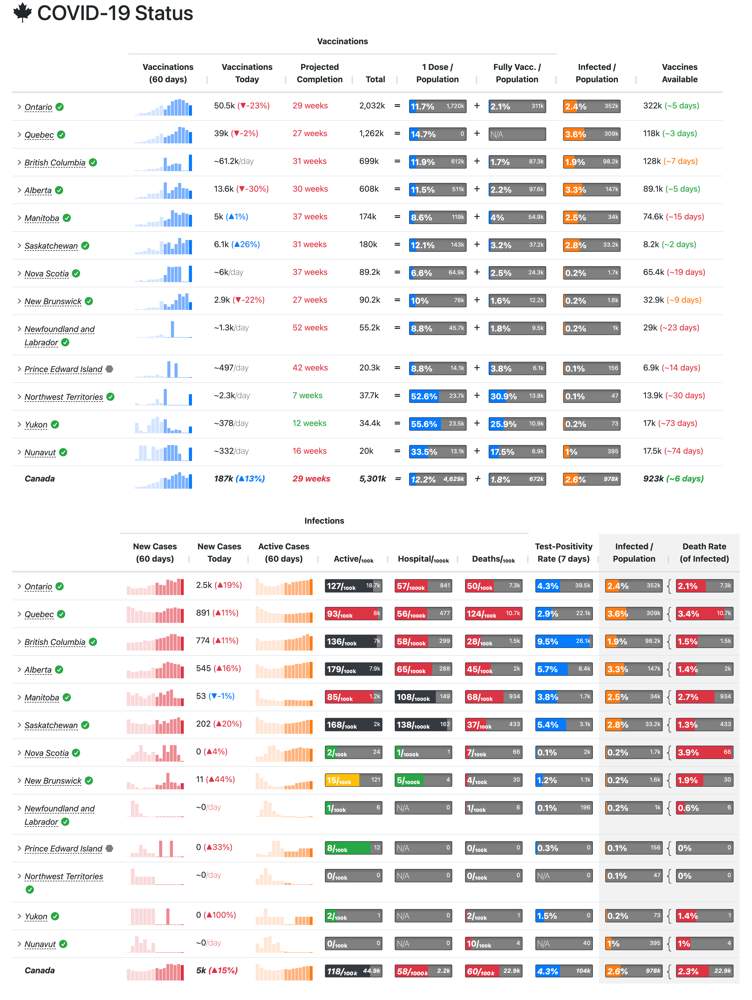

# Covid19 Canada > Dashboard

This 11ty project generates a unified dashboard to represent the vaccination progress as well as the infection rate of covid 19
throughout Canada, the provinces and the health regions. The data is refreshed hourly and reflects the status of the reported
data from each health region and province.

# Credits

This project was inspired by Noah Little's [Covid19 Tracker](https://covid19tracker.ca/) and uses an aggregation of
the community data that is collected daily.
